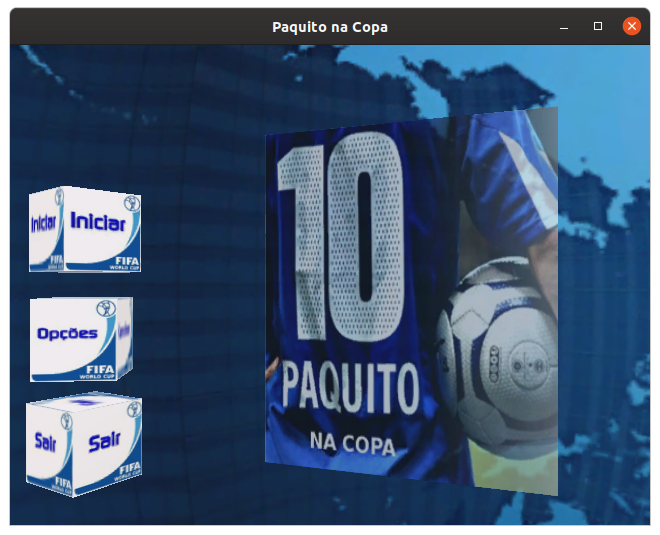

# Homework - Computer Graphics [](https://travis-ci.org/cfgnunes/homework-cg)

If you like this project, please consider making a donation to support the developer. [](https://www.paypal.com/cgi-bin/webscr?cmd=_s-xclick&hosted_button_id=2EDNU6LPSCH6S)

A simple program made with C, Freeglut, SDL2_Mixer and SOIL.



## Getting Started

### Prerequisites

This section assumes Ubuntu 16.04 (also tested on Ubuntu 18.04), but the procedure is similar for other Linux distributions. The prerequisites to build the source is to install the following packages:

```sh
sudo apt -y install build-essential cmake
sudo apt -y install freeglut3-dev libsdl2-mixer-dev libsoil-dev
```

### Build and run the project

To build the project, use:

```sh
mkdir build
cd build
cmake ..
cmake --build .
```

To run the project, use:

```sh
make run
```

## Built With

* [GCC](https://gcc.gnu.org/) - The GNU Compiler Collection
* [Freeglut](http://freeglut.sourceforge.net/) - A alternative to the OpenGL Utility Toolkit (GLUT) library
* [SDL2_mixer](https://www.libsdl.org/projects/SDL_mixer/) - A sound mixing library
* [SOIL](https://www.lonesock.net/soil.html) - Simple OpenGL Image Library

Other tools:

* [CMake](https://cmake.org/) - Build, test and package software

## Authors

* Cristiano Nunes
* Luiz Louro
* Márcio Aguilar
* Mateus Junho
